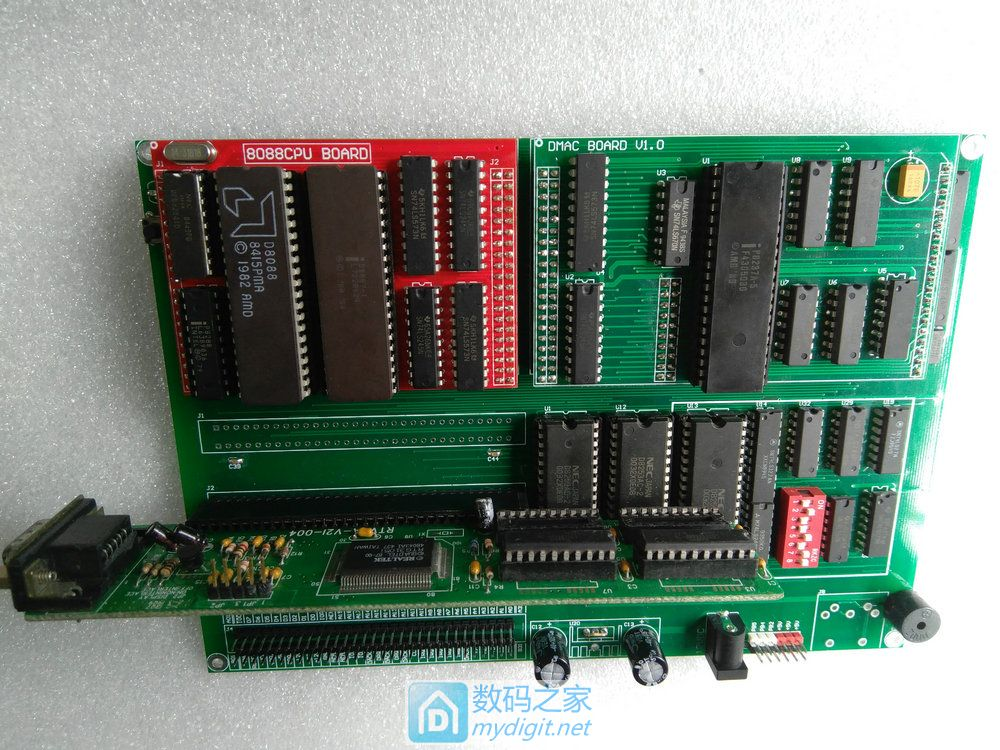

# DIY Your Own 8088 Vintage Computer, Running BASIC, Capable of Booting DOS

Originally posted at April 11, 2017:
[http://bbs.mydigit.cn/read.php?tid=2058263](http://bbs.mydigit.cn/read.php?tid=2058263)

Internet Archive:
[https://web.archive.org/web/20170521052437/http://bbs.mydigit.cn/read.php?tid=2058263](https://web.archive.org/web/20170521052437/http://bbs.mydigit.cn/read.php?tid=2058263)

Alternative Link:
[https://www.chinafix.com/thread-1101667-1-1.html](https://www.chinafix.com/thread-1101667-1-1.html)

Note: This post was intended for the DIY section, but it's also highly relevant to this forum since the chips and technologies used are from the 70s and 80s. Hence, I chose to post it here.

I believe everyone is familiar with the 8088 CPU and the principles of microcomputers. I studied them in college too, but due to time and technical limitations, I only delved deeply into the theory and the minimum system. Now, I've combined what I've learned to create a machine with an 8088 CPU myself. It can run the BASIC interpreter and DOS. Yes, you read that right. DOS.

## System Components

1. Chip selection:
CPU: 8088, clock chip 8284, bus controller 8288, DMA controller 8237, interrupt controller 8259, timer/counter 8253, parallel controller 8255. And some necessary logic chips.
2. Memory:
RAM uses SRAM, but is also compatible with DRAM.
ROM uses FLASH chips. The ROM is 64KB, using two 32KB ROM chips. The purpose of the ROM is to load BIOS and the BASIC interpreter.
3. Interfaces:
A PS2 five-pin interface is reserved for the keyboard. 4 eight-bit ISA slots are available for various expansion cards, such as hard disk cards, floppy drive cards, printer extensions, and graphics cards.

## Schematic Design (Schematics and PCB layouts are directly uploaded as attachments, so detailed drawings are not posted here)

1. CPU circuit: The 8284 provides all clocks, 8087 serves as a co-processor, 8259 for interrupt control, 8288 for bus control, and LS573 and LS245 for address/data line driving.
(Schematics and PCB layouts are directly uploaded, so detailed drawings are not posted here)
2. 8255 I/O interface circuit
The 8255 mainly extends I/O for various system settings and keyboard control.
(Schematics and PCB layouts are directly uploaded, so detailed drawings are not posted here)
3. DMA controller and timer/counter
The DMA controller is essential for the system because the hard disk, floppy disk, and graphics card all need to transfer large amounts of data. Without the DMA controller, all work would have to be done by the CPU. The DMA and the 8253 chip together generate the dynamic refresh signal required by DRAM.
(Schematics and PCB layouts are directly uploaded, so detailed drawings are not posted here)
4. RAM and ROM
The system board reserves 512KB of RAM (which can be expanded through an expansion card, up to 640KB). A total of 64KB of ROM, with 32KB for BIOS and 32KB for BASIC.
The BIOS is very important because it contains initialization data for various chips. After initializing the chips, the BIOS will boot into DOS from the floppy disk. If there is no floppy disk, the BIOS will look for a hard disk DISK BIOS. If present, it will boot from the hard disk. If there is no hard disk, the BIOS will boot into BASIC.
(Schematics and PCB layouts are directly uploaded, so detailed drawings are not posted here)
5. XT Bus
Provides four 8-bit ISA-compatible interfaces, mainly for expanding hard or floppy disks, graphics cards.
The power supply mainly has +-5V, +-12V, but the system only needs a single 5V to operate.

## PCB Design

There's not much to say here, it's all about the circuitry.

The complete circuit board (the graphics card is a purchased 8-bit ISA VGA card)

Motherboard

CPU and DMAC

With the graphics card inserted:

Next is the boot process. Since the VGA monitor I found doesn't take good photos, I can only take them at an angle, please don't mind.
The first three lines are graphics card information (data provided by the BIOS in the graphics card), followed by graphics card error prompts and IO board error prompts, 512KB memory self-test (this self-test is meaningless, as there is no parity check logic)

Next, the system attempts to boot, but unfortunately, I've spent a long time searching and haven't found a good hard disk or floppy disk (8-bit ISA card-driven floppy disks are too hard to find, and I couldn't find a good floppy drive either). I'll update this if I find one later. After waiting for a while, if the system can't find a bootable system, it will directly enter the BASIC interpreter.

Let's try editing and running a program, it still works.

Attachment: [8088 computer.rar (1898 K) ](https://9game.oss-us-west-1.aliyuncs.com/book8088stories/files/20170411_8088_computer.rar)

The drawings in the attachment are divided into four parts: the main board, CPU board, DMAC board, and 640KB memory board.

The lower 512KB of the 640KB memory expansion board is address-overlapping with the onboard 512KB, meaning if you use the expansion board, you can avoid using the onboard memory.
The 640KB memory board is universal for 8-bit PCs, meaning if you have an 8-bit PC, you can also use it.
DIY Your Own 8088 Vintage Computer, Running BASIC, Capable of Booting DOS

The RAM board hasn't been made yet, so here's a 3D preview for now.
DIY Your Own 8088 Vintage Computer, Running BASIC, Capable of Booting DOS

====The End, Thank You All=====

[ROM BIOS and BASIC Interpreter Program](https://9game.oss-us-west-1.aliyuncs.com/book8088stories/files/20170411_rom_basic.rar)