# Testing a 2018-Made 8-bit CGA Graphics Card Live

Originally posted at October 18, 2018: [http://bbs.mydigit.cn/read.php?tid=2560948](http://bbs.mydigit.cn/read.php?tid=2560948)

To be precise, the title should be "DIY a CGA Graphics Card"
Due to spending all my spare time on the 8088 project recently, progress has been quite rapid. Here's a newly made CGA card for everyone to appreciate.
This CGA card (a character card) can function as both a character and graphics card.
The CGA resolution is supposed to be 640x200. However, my LCD only supports 320x240, so... it's a bit of a compromise.
First, let's see a picture. STC12C5A60S2 microcontroller + vintage 4KB RAM + TFT LCD screen (The refresh rate driven by the 51 microcontroller for the TFT is horrifyingly low, but it doesn't show in the picture)

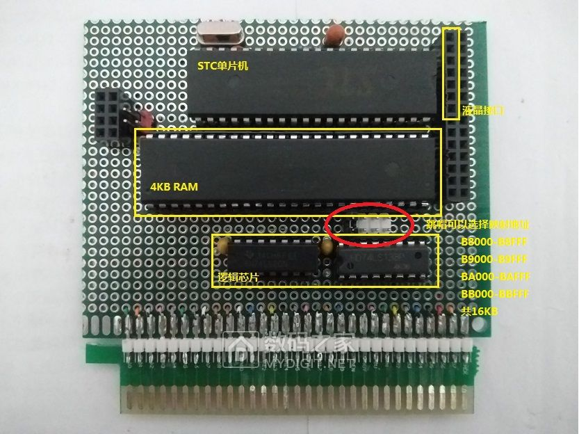

Just like that, a card made in 2018. The video memory mapping address is B8000-BBFFF.

Let's briefly discuss the setup.
## Simplified CGA Graphics Card Principle
A CGA occupies 16KB of memory space, starting from B8000. B8000 is the first data to be displayed, B8001 is the attribute of this data (blinking, color, etc.), B8002 is the second data to be displayed, and so on. It can display up to 80x25 characters. A screen requires 2000 bytes of address space to store the characters to be displayed, and another 2000 bytes to store their attributes. That's a total of ~4KB. 16KB can store 4 pages.

There are two approaches to this card, both of which I've experimented with.

**Approach One**: The PC directly accesses Video RAM, and the MCU reads the RAM data and displays it. This approach is relatively simple in principle but complex in circuitry.

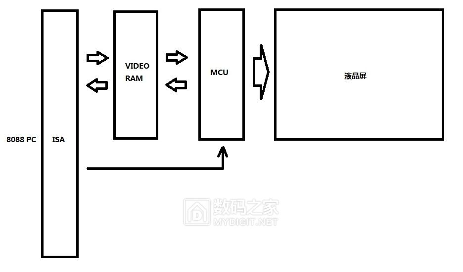

**Approach Two**: Communication between the PC and MCU. This way... skipping 10,000 words.

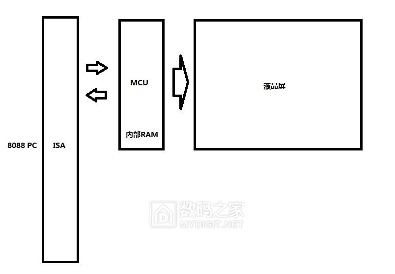

A diagram drawn in a minute, don't mind the crudeness.

So, these are the two approaches, and this card uses the first one.

## Fabrication Process:
Long ago, I made an ISA interface + universal board + double-row pin connection (meticulous).

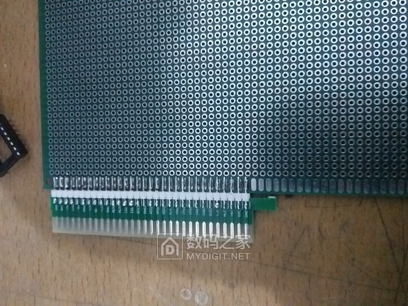

And here's the back (those with OCD, you might want to stop here and not look further, as it might cause discomfort)

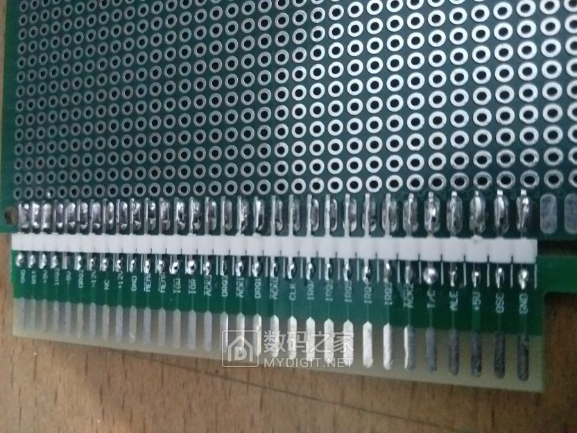

First, arrange the chip positions, ready for flying wires (am I supposed to talk about solder surface tension here?)

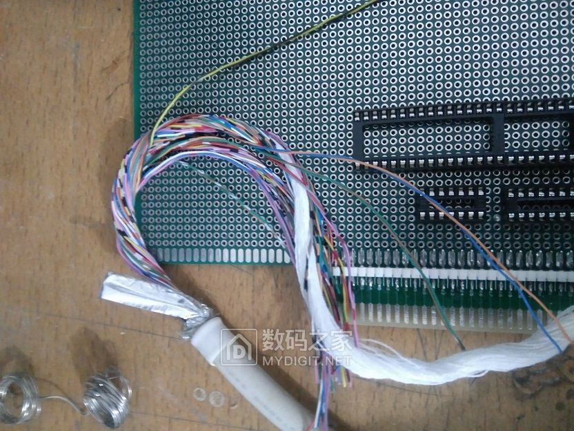

After soldering, it looks like this (since this isn't exactly a technical post, I'll skip the more detailed process)

Attach the LCD screen and we're done?

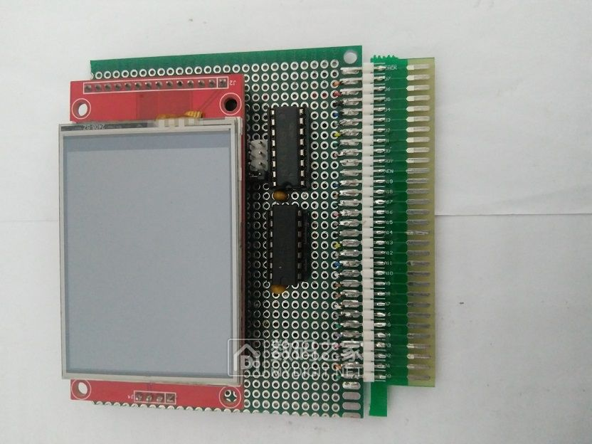

Obviously, there's another picture, and this is the key point. The soul-destroying flying wires

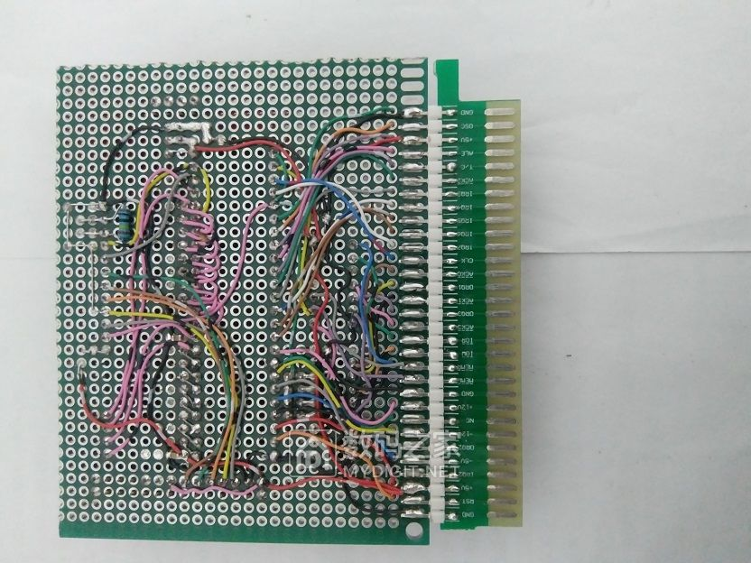

Next, a simple test:
First, plug it into an IBM XT compatible motherboard. I like this motherboard; it has low power consumption and few components. It should be fully compatible with the IBM 5160.

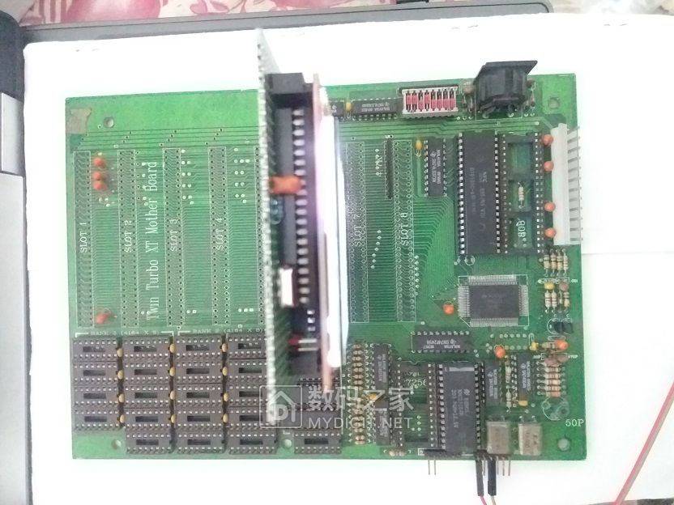

Too dark...

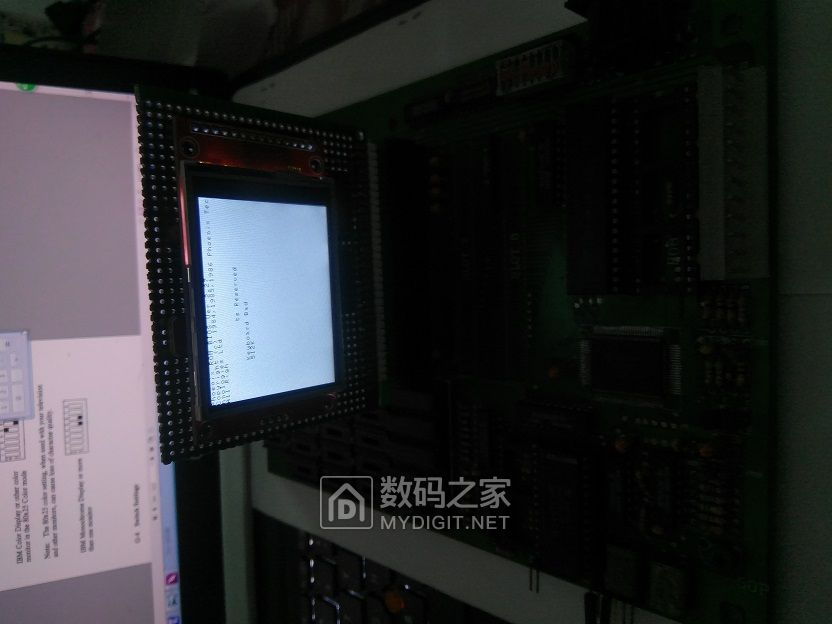

Here's a clearer one. This motherboard uses Phoenix BIOS. The display is a bit messy, mainly because the LCD's resolution isn't enough, causing premature line breaks. It's using an 8x8 font, which is already the smallest.

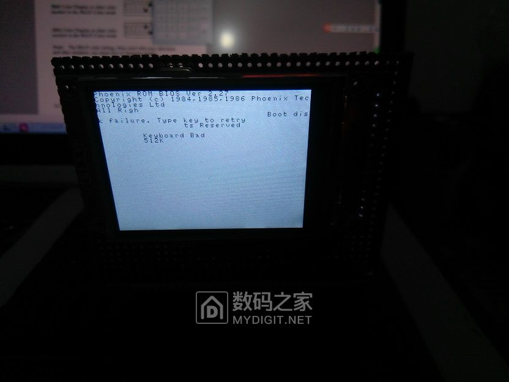

Then, plug it into my own XT PC compatible motherboard to see the effects.

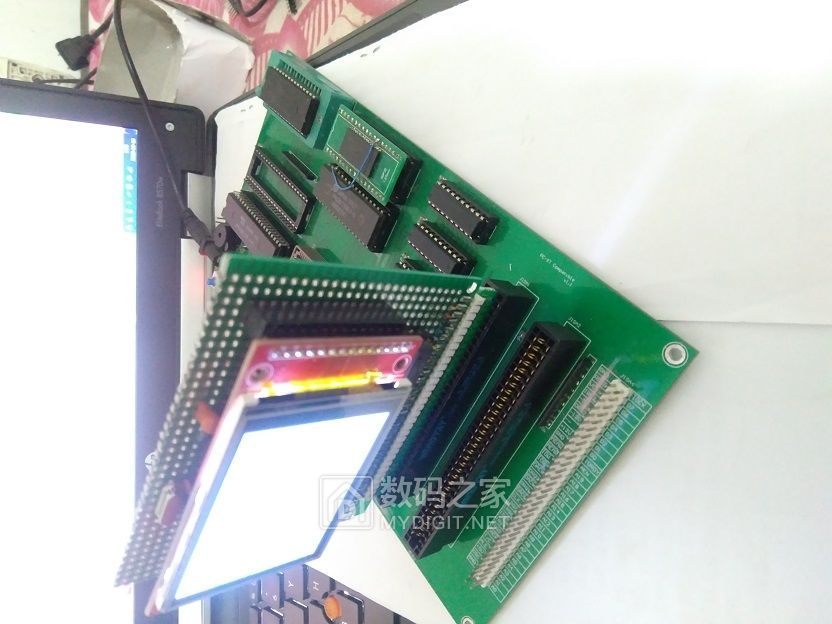

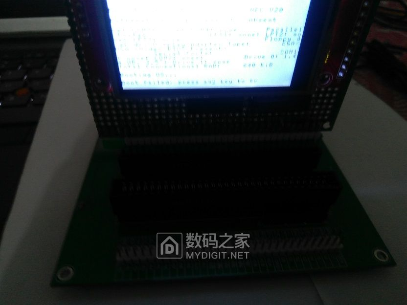

Can only say it's good enough that it can display

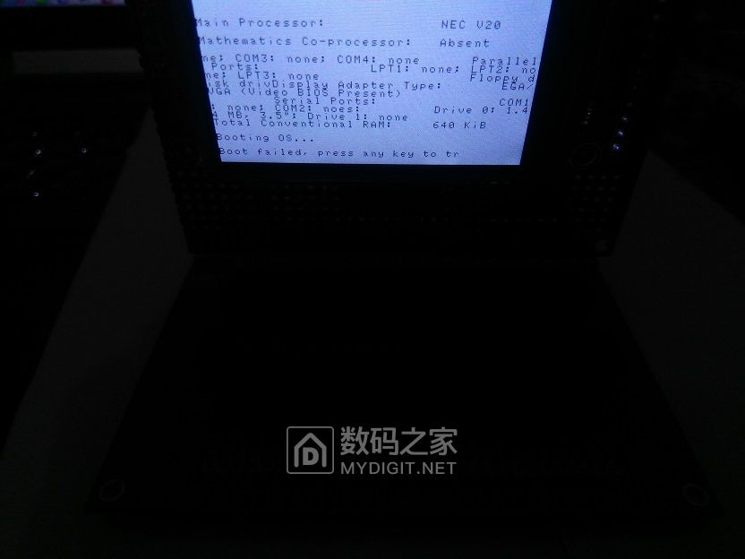

I had previously made an even simpler CGA card.

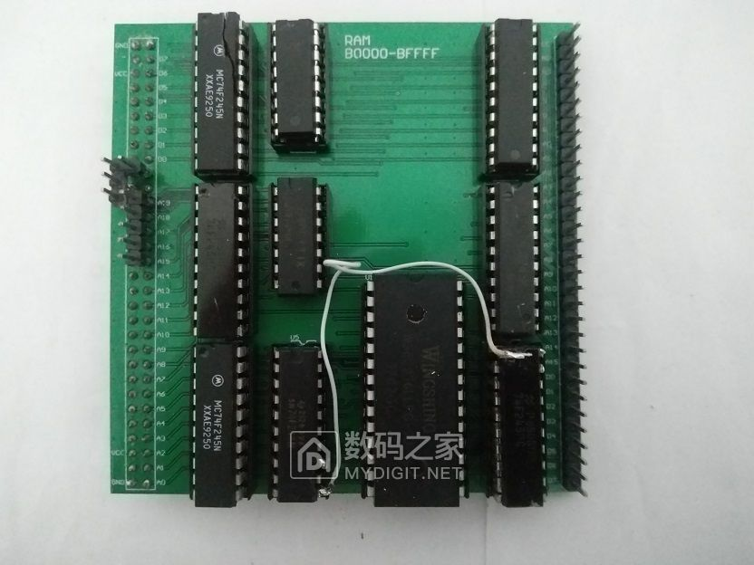

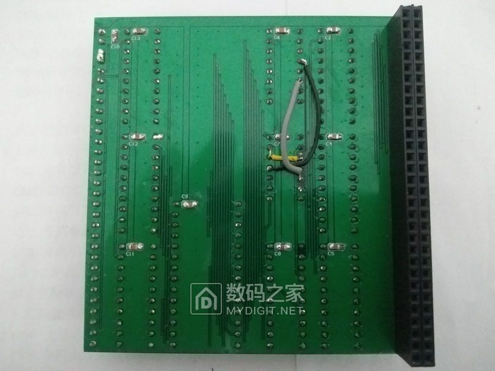

However, this card consumes a bit too much power, so it's better off stored in the warehouse.

Actually, a complete graphics card needs not just video memory, but also many registers to provide information to the CPU, as well as a Video BIOS to perform better. Unfortunately, I'm short on time. This post is meant to spark interest, as I'm currently working on a complete IBM-compatible machine (laptop). The motherboard, BIOS, and keyboard (still needs some optimization) are done, and the graphics card (this post's card will be the prototype). Seems like there's still a lot of work to be done.