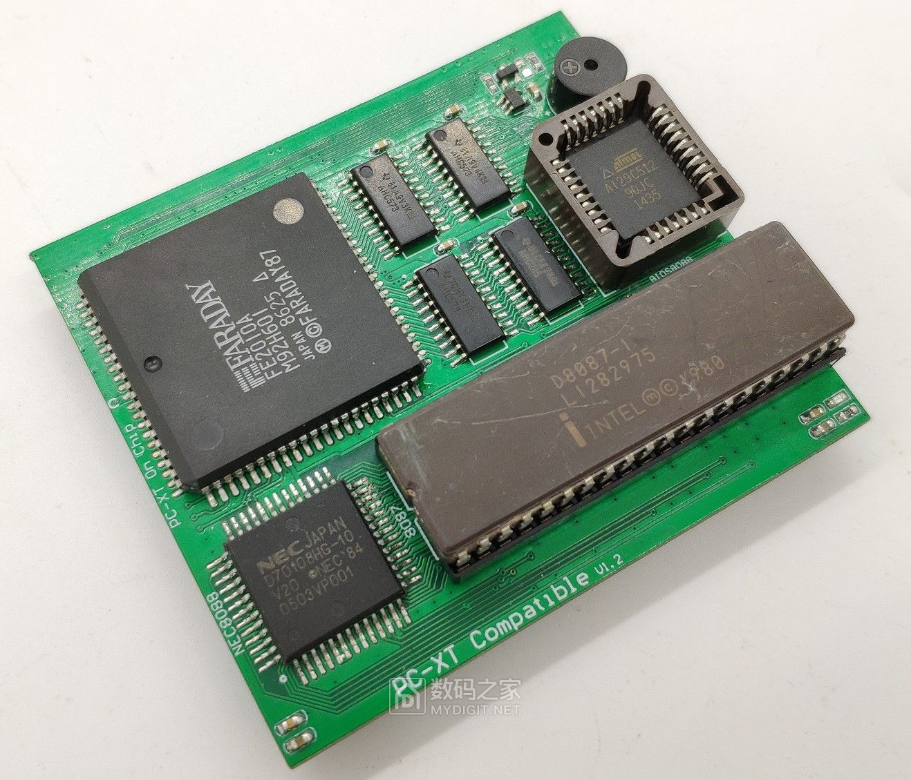
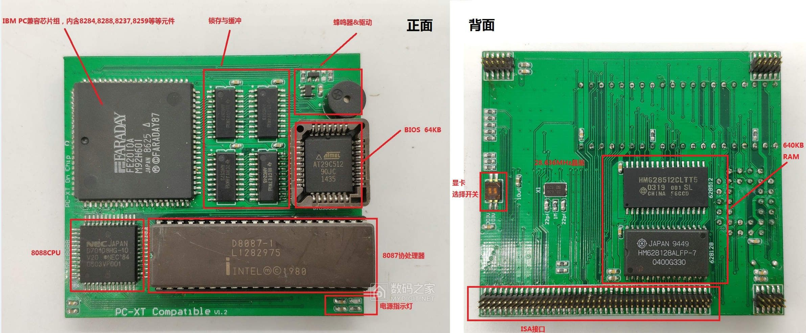
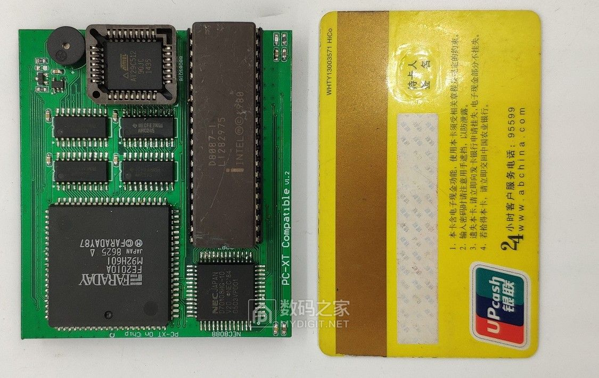
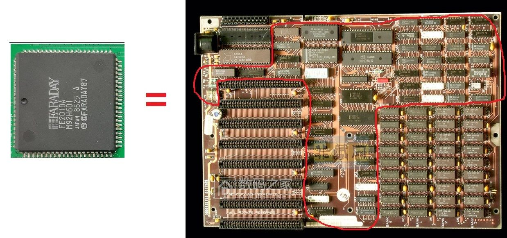
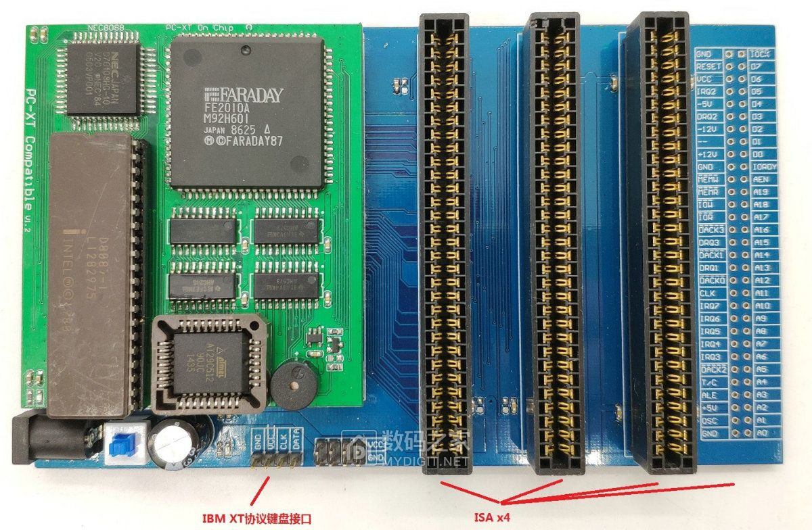
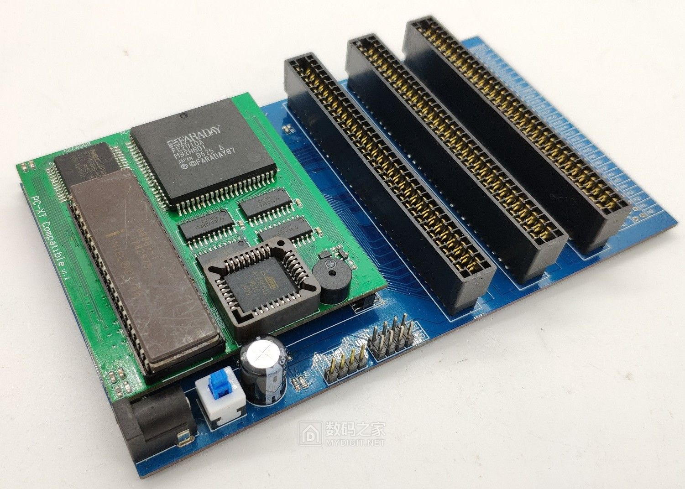
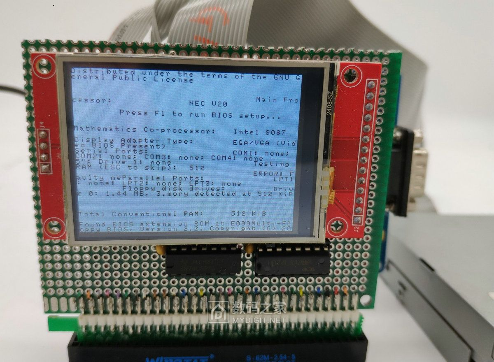
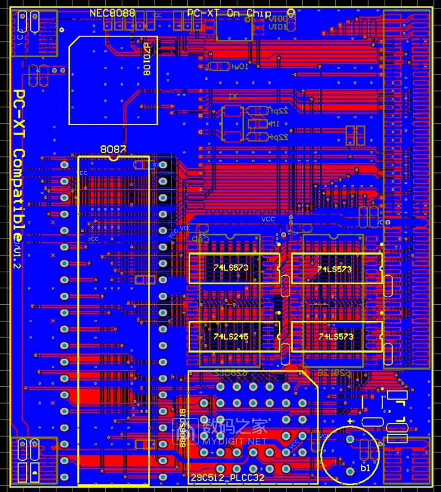
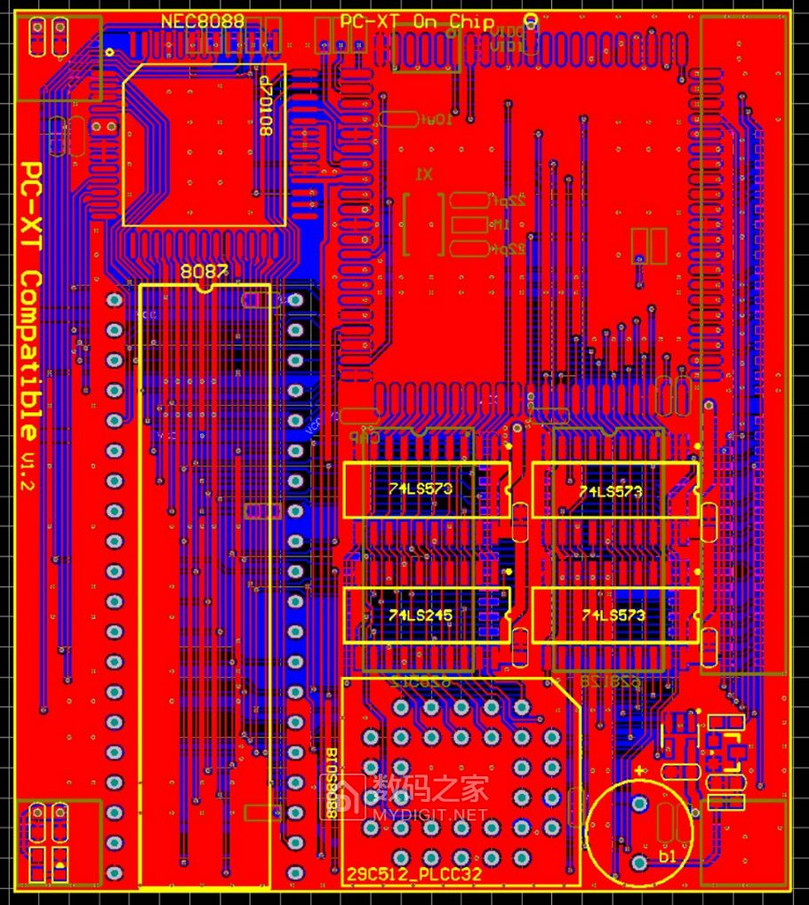

# 制作8088 CPU卡片电脑，只有银行卡大小的IBM PC兼容机！

Originally posted at March 4, 2019:
http://bbs.mydigit.cn/read.php?tid=2663397

Internet Archive:
https://web.archive.org/web/20191017153540/http://bbs.mydigit.cn/read.php?tid=2663397

Alternative Link:
http://www.haodiy.net/m/view.php?aid=15039

距离上次发8088主板帖子已经有两年了，期间由于工作原因一直在研究和跟进，但是没时间发帖，其实这块板子已经做出来将近一年了，现发给大家研究研究，抛砖引玉。（认真发帖求精华）
（开发资料在附件中，有原理图，PCB设计图，BIOS源码，还有用到的软驱控制器是国外开源项目，附上网址，大家有兴趣可以看看，另外BIOS源码也是使用的国外开源的源码，也可以使用IBM的BIOS，都是兼容的）
图纸，BIOS，手册等

[Faraday-XT_Controller-FE2010.pdf (607 K) ](https://9game.oss-us-west-1.aliyuncs.com/book8088stories/files/20190304_Faraday-XT_Controller-FE2010.pdf)

[CPU核心板.rar (560 K) ](https://9game.oss-us-west-1.aliyuncs.com/book8088stories/files/20190304_CPU_board.rar)

[扩展底板.rar (515 K) ](https://9game.oss-us-west-1.aliyuncs.com/book8088stories/files/20190304_expand_board.rar)

[ISA卡 DiskOnChip.rar (443 K) ](https://9game.oss-us-west-1.aliyuncs.com/book8088stories/files/20190304_ISA_DiskOnChip.rar)

[bios.rar (220 K) ](https://9game.oss-us-west-1.aliyuncs.com/book8088stories/files/20190304_bios.rar)

这是一块兼容IBM XT机的核心板：

CPU：8088CPU(NEC V20)，8087协处理器；（NEC V20也是一片完全兼容8088的CPU，不过V20功耗更低，性能也比8088要高）
芯片组：FE2010A（后面单独介绍）其实就是8284,8259,8255,8288,8237...等等兼容IBM PC的外围芯片大合集
内存：512+128=640KB RAM，64KB BIOS ROM
扬声器：兼容IBM PC蜂鸣器
键盘：兼容IBM PC键盘（XT协议键盘接口）
这块核心板是我打算用于制作一台笔记本电脑的，笔记本也正在制作中，可谓是十年磨一剑，每个电路都是先做模块，后期再集合在一起。今天发帖是用的一块测试核心板专用的底板，底板就是引出排针，转成标准的ISA接口。废话不多说，先来图片吧。图文慢慢介绍。

1，核心板：就是下图中这块，图上有文字介绍。
 

由于图片大小限制，所以只能压缩一下了，下面这张上核心板正反面照片

和银行卡对比一下

如下图： 如果把核心板和IBM PC比的话大概就是这样

那么FE2010A差不多就等效成这样

接下来是做的一张底板，用来测试的。上面没有芯片，就是引出线而已。

装上核心板

侧面再来一张

接下来就是测试了。测试用到了软驱，硬盘（DISK ON CHIP），显卡+tft液晶屏
开源ISA软驱卡地址：http://www.malinov.com/Home/sergeys-projects/isa-fdc-and-uart

组合一下

这里使用IBM DOS3.3

开机：

由于液晶屏分辨率不够，所以显示并不完整。将就看看吧。

由于没有插键盘，这里要提示引导软驱里的系统，（，液晶屏分辨率不够，没显示那句话，各位有兴趣回去自己做一个慢慢试吧。）
显卡可以使用普通的ISA显卡，8位的基本都支持，CGA，MDA，VGA都可以。只是我这摄影棚很小。还得接显示器，麻烦。

__________________

这里介绍一下FE2010A这款芯片，其实这种芯片很多。就是把8284,8288,8237等IBM PC机上的外围芯片集合在一起了，后面我会附上手册。

FE2010A其实不是最常用的。体积也不是最小的。国外也有朋友用这款芯片制作过主板，我也用的他的BIOS，我也是在查找芯片时才看到有人在做，我觉得很开心，因为看到有人有共同爱好，所以才花了几个月时间做这块核心板。因为我之前一直研究的是另一款芯片，其实功能都是一样的。

__________________

PCB排版和布线全是手工一条条的，由于只用了双面板，所以走线空间很紧张，所以焊盘上都打了过孔（手工焊接其实完全不影响，电气性能也是完全没问题的），光布线都改了好多次，用了将近2个月业余时间。
 

-----------全文完，谢谢观赏---------

资料已更新，我还有很多DIY实验和作品，实在未能一一上传，如果有喜欢DIY8088的朋友可以找我索要其他资料、等我的笔记本做好后再分享给大家。
