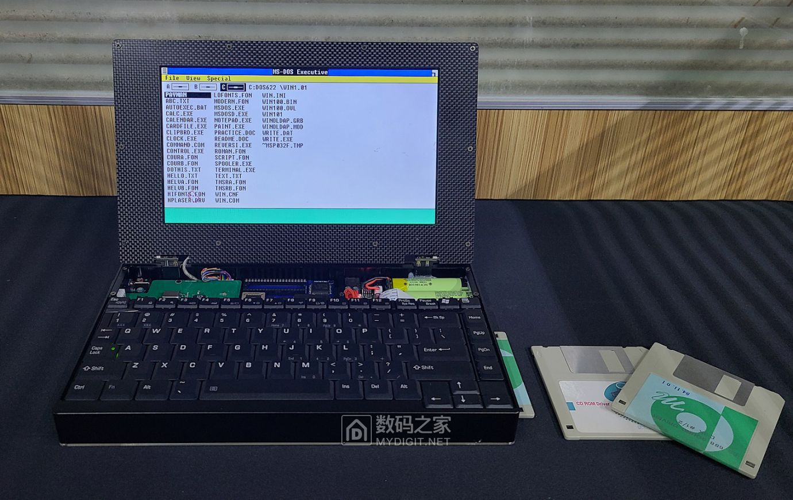
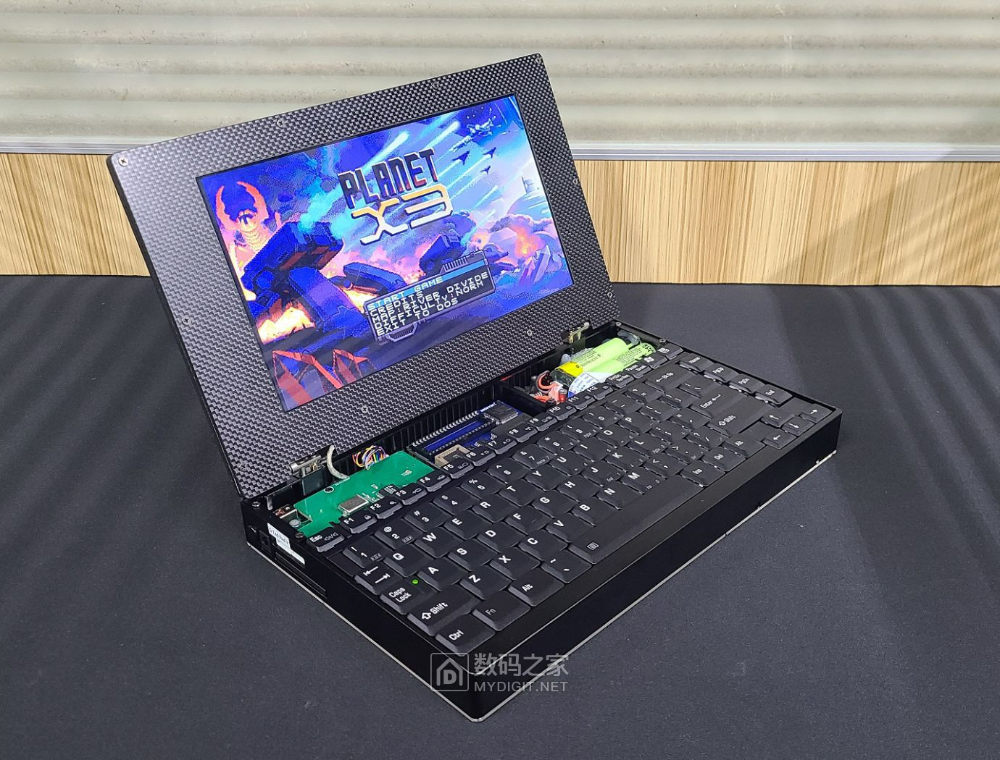
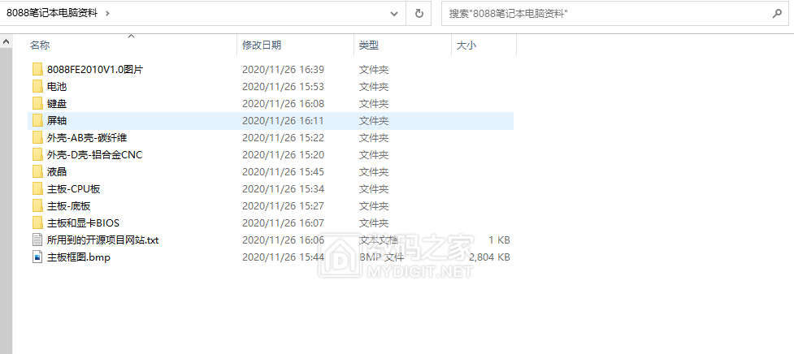
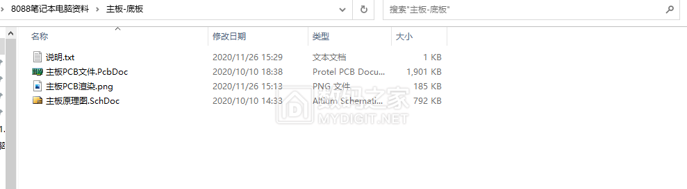

# 8088笔记本制作资料/可以运行Windows 2.0

Originally posted at November 26, 2020: [https://www.mydigit.cn/thread-214214-1-1.html](https://www.mydigit.cn/thread-214214-1-1.html)

## 【说明】
各位古董电脑迷们大家好：
此电脑是属于复刻电脑，CPU，芯片组，是使用同时代古董芯片。 但是CF卡，显卡，键盘都是现代的各种兼容复刻。目的是简化电路和提升实用性。使用上，系统和软件都能100%兼容IBM PC。
由于此贴主要是分享资料和交流经验，所以没有把冗长的制作过程一一拍图。贴子内容也很简单。
之前也发过关于8088CPU的电脑制作贴，本不打算再发，不过整理资料不易，不发也很遗憾。现在我已经开始在制作386/486的笔记本并且流畅运行Windows95。后面会一一分享给大家。
另外在此感谢给予帮助的各位朋友，特别是在软件和系统上非常精通的张大哥([hustoj/bilibili](https://space.bilibili.com/400391293))的鼎力帮助。因为我只会硬件，软件和使用上经验很少。
还有8bit guy的plantX3，我很喜欢这款游戏，但我使用了盗版。所以图片恰饭给你作为补偿:lol:。

## 【电脑配置】
- CPU：8088（NEC V20）10Mhz
- 内存：640KB
- 显卡：TVGA900i  512Kb
- 硬盘：CF卡2G
- 液晶：1024x600
- 软驱：3.5寸 1.44M

## 【成品图片】

## 【资料说明】
资料内含PCB和原理图，bios，参考资料，外壳图纸等各种资料，每个文件夹内有小说明。但是没有细节到螺钉或者类似细节。

## 【制作视频】
https://b23.tv/qsvIxh

## 【资料】
[8088_resources.rar](https://9game.oss-us-west-1.aliyuncs.com/book8088stories/files/20201126_8088_resources.rar)