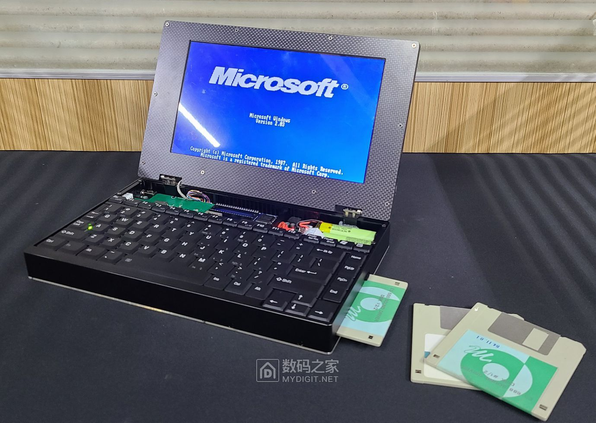
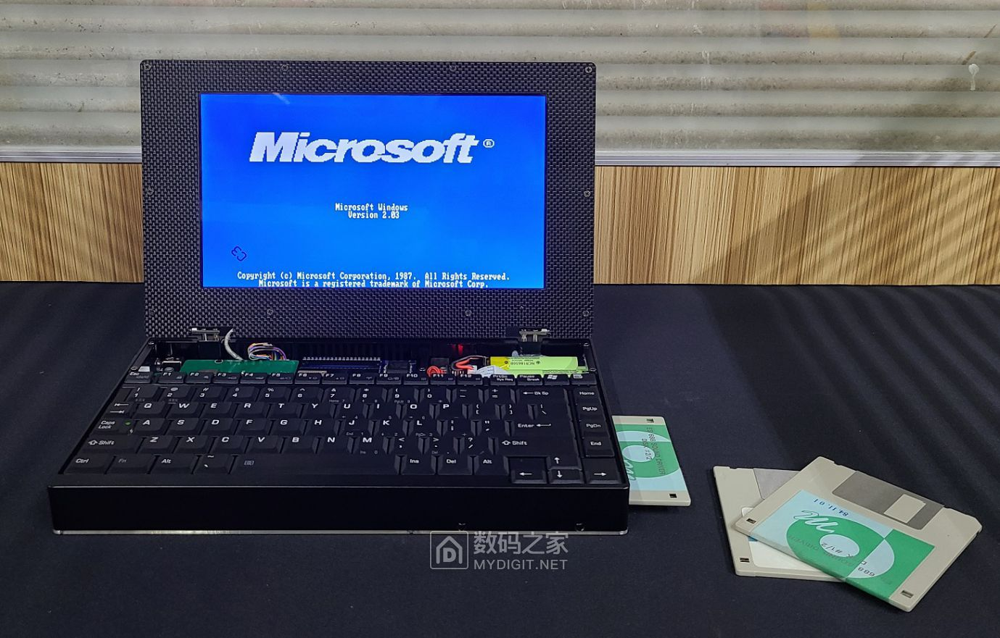
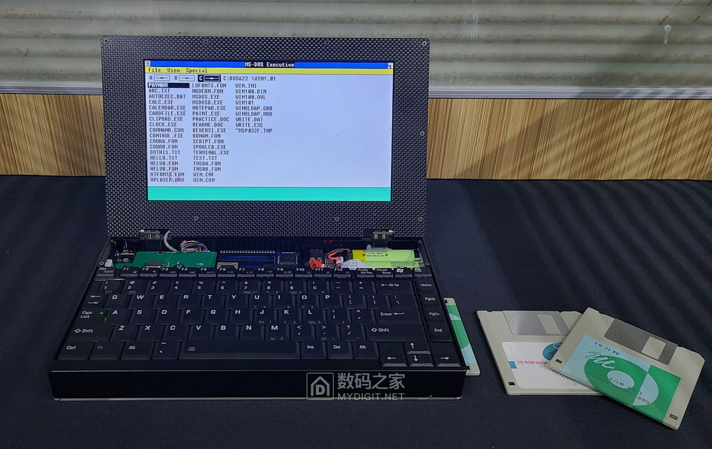
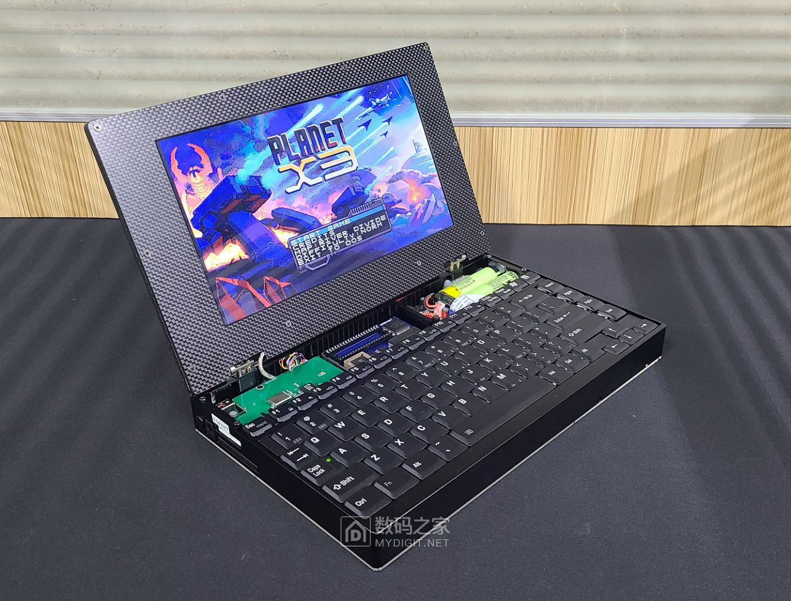
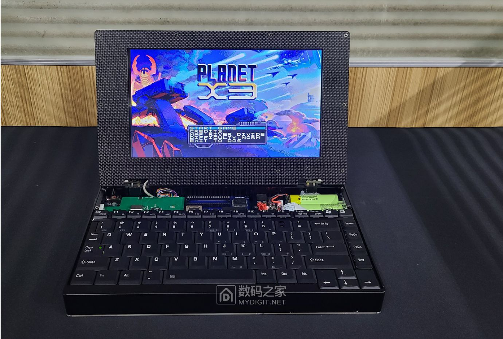
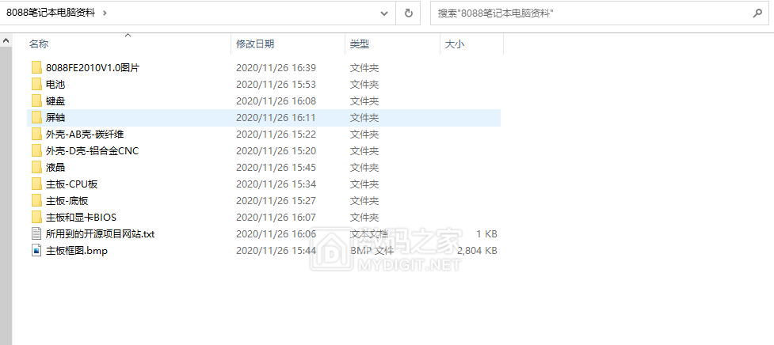
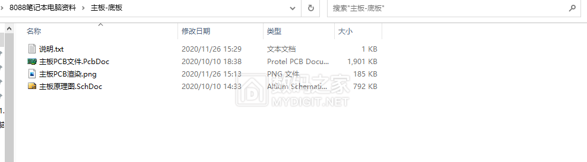

# 8088 Laptop Creation Materials / Can Run Windows 2.0

Originally posted on November 26, 2020:
https://www.mydigit.cn/thread-214214-1-1.html

## 【Description】
Hello, vintage computer enthusiasts:
This computer is a replica, utilizing contemporaneous vintage chips for the CPU and chipset. However, the CF card, graphics card, and keyboard are all modern compatibles and replicas. The goal is to simplify the circuitry and enhance practicality. In use, the system and software are 100% compatible with the IBM PC.
Since this post is mainly to share materials and exchange experiences, the lengthy creation process is not documented in detail. The content of the post is also quite simple.
I've previously posted about creating computers with the 8088 CPU and wasn't planning to post again, but it seemed a shame not to share the compiled materials. I have now started creating laptops with 386/486 processors that smoothly run Windows 95. I'll share these with everyone in the future.
I also want to thank the friends who have helped, especially Brother Zhang ([hustoj/bilibili](https://space.bilibili.com/400391293)), who is very knowledgeable about software and systems. His tremendous help has been invaluable since I only specialize in hardware and have little experience with software and usage.
And a shoutout to the 8bit guy's PlantX3, a game I really enjoy but have pirated. So, consider this picture a form of compensation :lol:.

## 【Computer Configuration】
- CPU: 8088 (NEC V20) 10Mhz
- Memory: 640KB
- Graphics Card: TVGA900i 512Kb
- Hard Drive: 2G CF card
- LCD: 1024x600
- Floppy Drive: 3.5 inch 1.44M

## 【Finished Product Photos】

## 【Material Description】
The materials include PCBs and schematics, BIOS, reference materials, casing drawings, etc., with brief descriptions in each folder. However, it doesn't detail down to screws or similar minutiae.

## 【Creation Video】
https://b23.tv/qsvIxh

## 【Materials】
[8088_resources.rar](attachment\20201126_8088_resources.rar)