# 制作梦想中的笔记本-386SX 运行windows95

Originally posted at April 23, 2023:
https://www.mydigit.cn/thread-383605-1-1.html

各位坛友 大家好！

从第一次复刻IBM PC兼容机发帖到现在已经相距7年,从楼主学微机原理到现在已经有12年。这期间我从未放弃过学习，也认识了很多对电子，复古电脑感兴趣的朋友。每当我提及我的想法时都会得到太多的质疑，为什么要花这么多时间研究，有什么用处，这些过时技术值不值得。其实每个人都有兴趣爱好，这也是很普通的一个爱好而已，并且它是确确实实对工作有极大帮助。我也会坚持学习下去，以后也会持续更新。感谢大家的支持！

运行Windows95的最低要求是什么？答案是386SX, 这是一枚完整386核心的CPU，只是它的外部总线是16位，但是这并不影响32位的指令。所以386SX是完全可以胜任的。

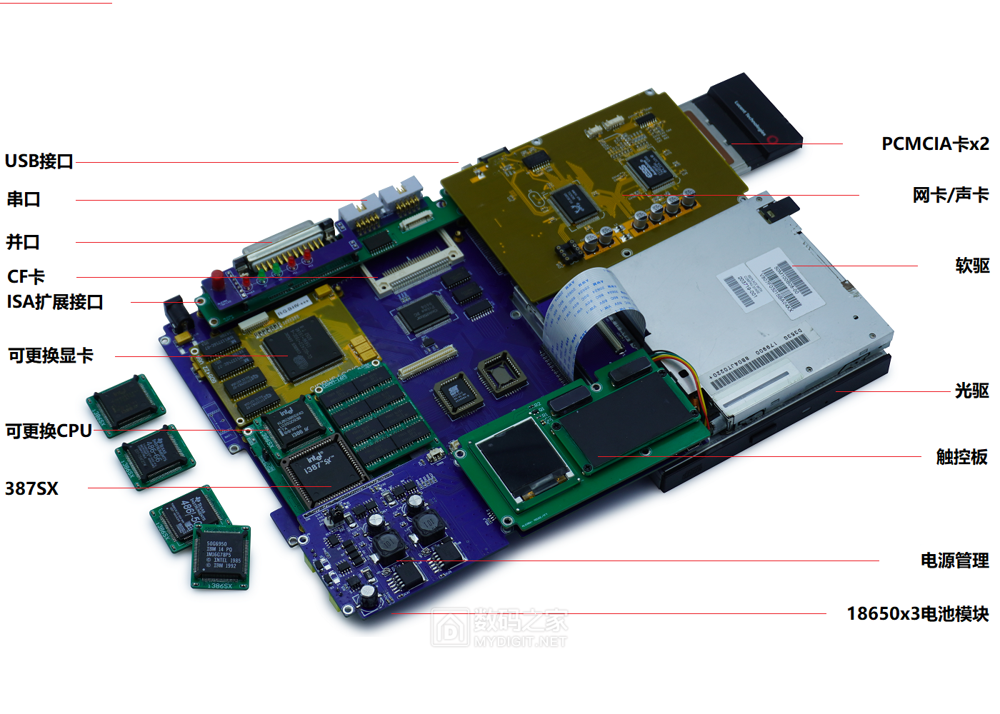

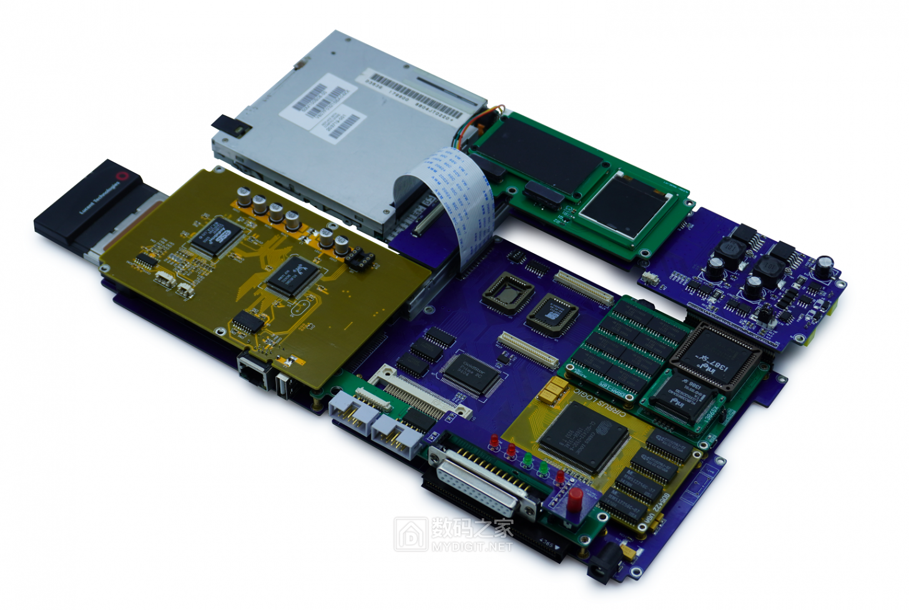

这是我设计的一台搭载386SX CPU的笔记本主体，它具有模块化的设计，可以更换CPU，内存，显卡，声卡，网卡这些主要部件。不仅如此！它的CPU是搭载在一个单独的模块上面，这个模块包含了CPU 内存 芯片组 ，也就是说更换了这个模块就等于是换了整个平台，以后做了486核心模块可以不用再换底板和其他部件。

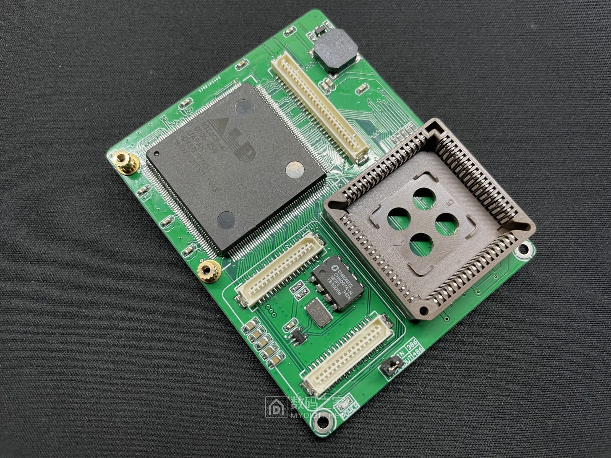

这是芯片组模块，它其实就是一片完整的主板，底部是一个16位的ISA接口。其他的模块都是通过这个ISA接口进口扩展，它包含了一颗ALD93c308芯片组，可能大家对这个芯片组并不熟悉，但是相信很多朋友都见过类似这样的黄色386主板，(楼主使用的是93c308版本)，芯片组本身没有任何资料，但是其他芯片是已知引脚定义的，所以我们并不难得到93C308芯片组的引脚定义(由于描述这个过程可能涉及到些不可预测的影响，所以我略过描述)，此后我们便可以规划属于自己的电路板。

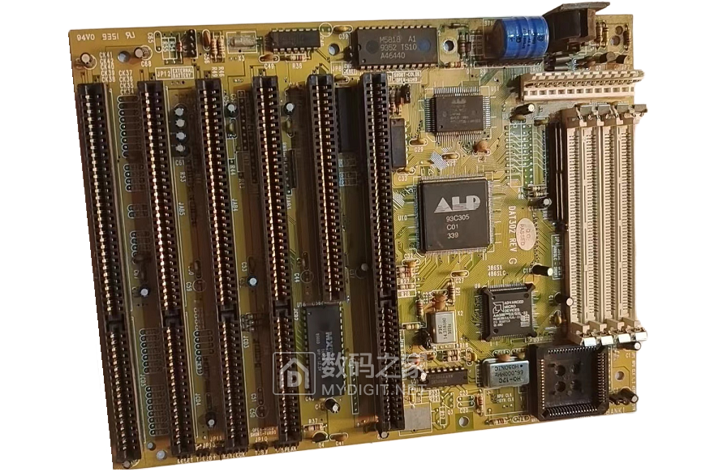
(网图 386SX主板)

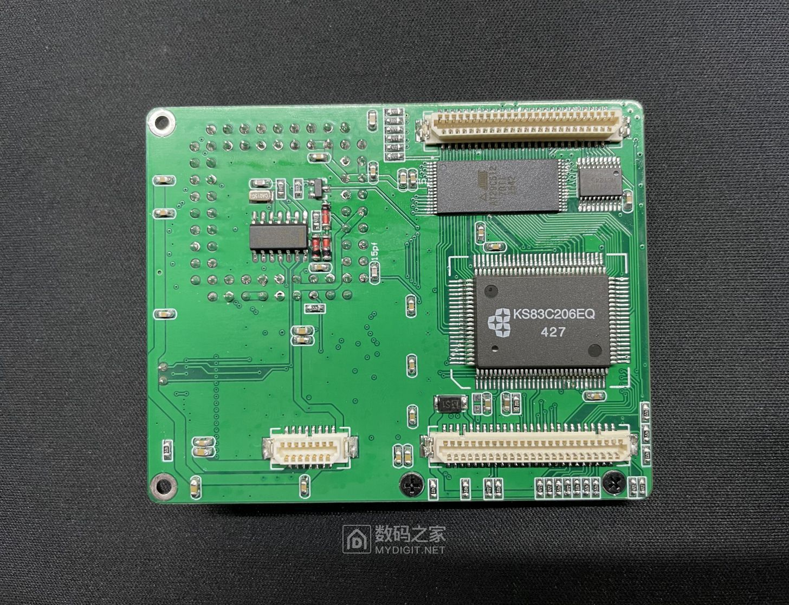
主板模块底面主要由ISA总线控制器(内含RTC时钟)和BIOS，以及ISA扩展接口组成。

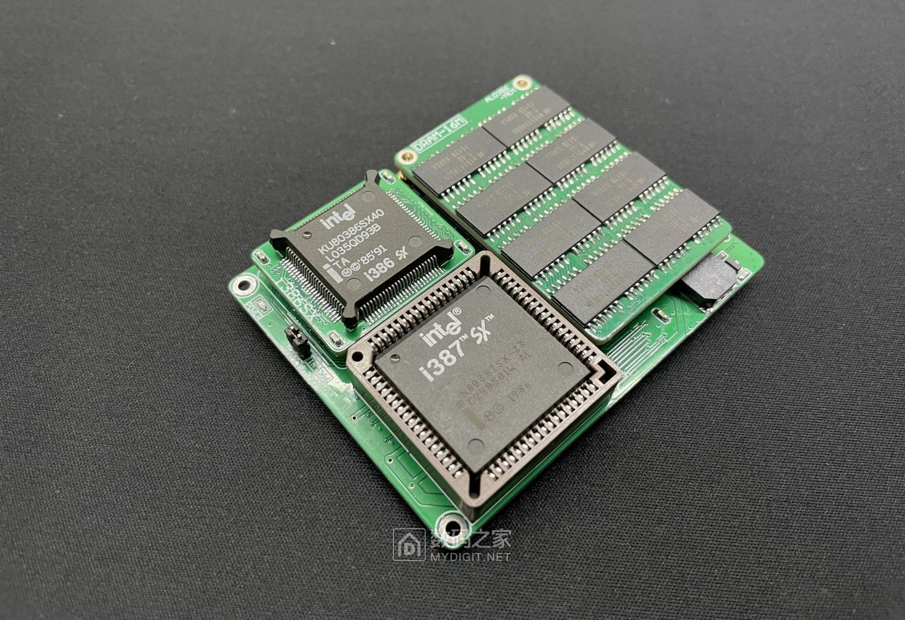

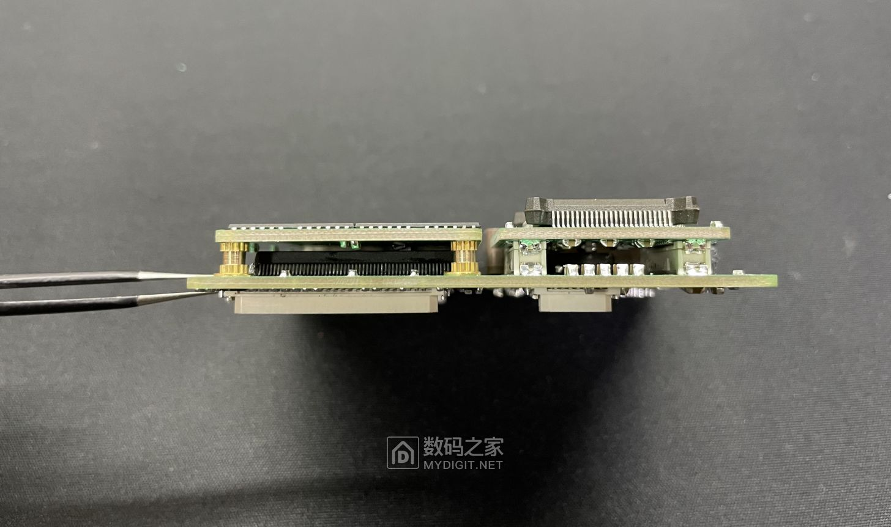

在装上其他模块后，就完成了主板模块的构建。它支持386SX，也支持486SLC和486DLC，虽然486SLC/DLC只能算是增强版的386SX，但是实测效果已经超越了386DX，可以说有很大提升。我们自然要对它所支持CPU进行一番研究。

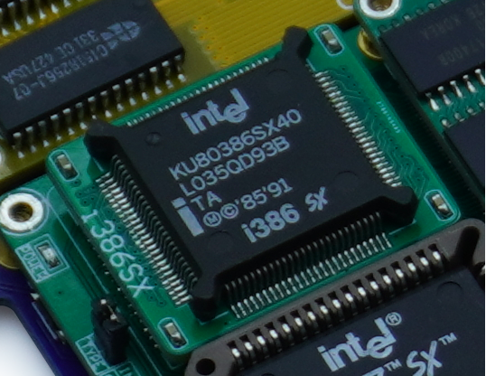

首先，是这枚基础款的386SX40，它可以稳定运行在40MHZ频率，主频高达0.04GHZ，虽然它是386家族中最廉价的成员之一，但是它以40MHZ的主频绝对可以超越早期的低频386DX版本。并且它拥有更先进的制程(指1000纳米工艺),所以比起早期的电老虎版本来讲，它的功耗在整机中可以忽略不计。

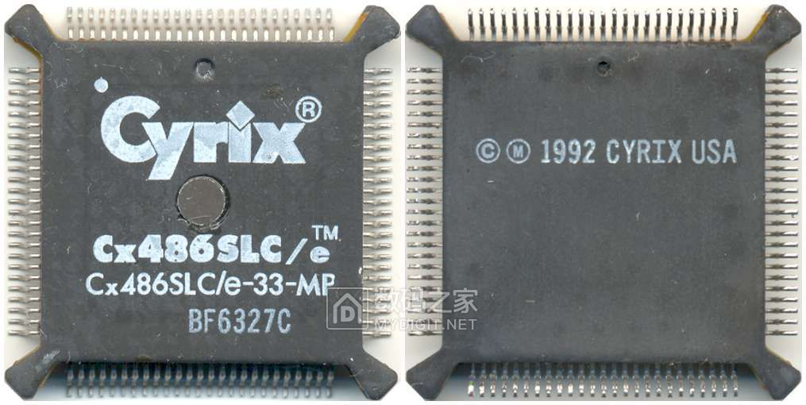

第二介绍的是Cyrix 486SLC，这是Cyrix与1992年发布的第一款CPU，SLC-25/33分别是25M和33M主频，虽然具有1KB L1缓存和486的一些指令，但是它并不如386SX40，并且功耗也大。但是其后推出的SLC2却具有50Mhz主频，在这个主频决定性能的年代，其性能已经完胜386SX40。

第三介绍的是Ti 486SXLC2-50/66，它们具有8KB的L1缓存，内部均是2倍时钟运行，使得主频高达50/66MHZ，性能较386SX40有很大提升。

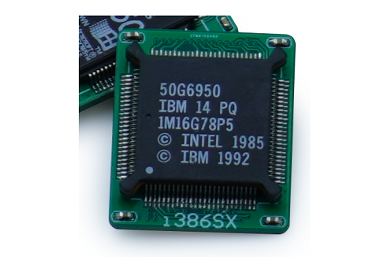

第四是IBM推出的486SLC2，这款芯片之所以少见的原因是当时INTEL并不允许IBM单独出售这枚芯片，但是运行它搭载在主板上出售，所以这枚CPU大多数搭载在IBM自己的PS2机型以及OEM主板上，它具有16KB的缓存。另外还有一款486SLC3处理器，以3倍时钟频率运行，主频最高可以达到100MHZ！，我在购买了很多据说搭载有此芯片的ps2主机后，虽然得到了此芯片。由于资料实在太少，而且主板采用了IBM自己的MCA总线，导致开发遇到重重困难，只能无奈放弃。

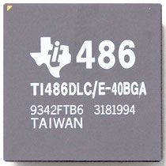

最后，这款芯片组也支持具有32位总线的486DLC处理器，这款处理器可以以16位总线模式运行。由于芯片对于我们的模块来讲过于庞大，我们并没有去设计相关模块，不过可以确定的是可以完美支持，性能和486SLC2相同。

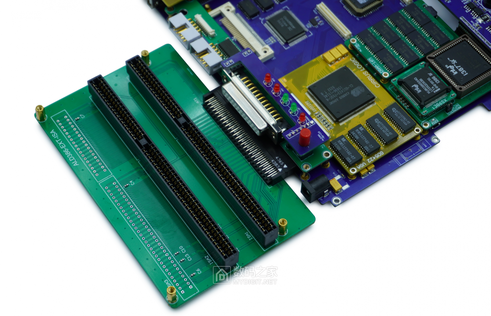

在前面我们已经介绍过主体搭载的一些模块。有两个比较重要的扩展接口。其中ISA接口自然是DIY必不可少一个，这次设计预留了一个完整16位的ISA接口，搭配扩展板可以扩展出3条ISA，可以扩展一些主板之外的功能卡。

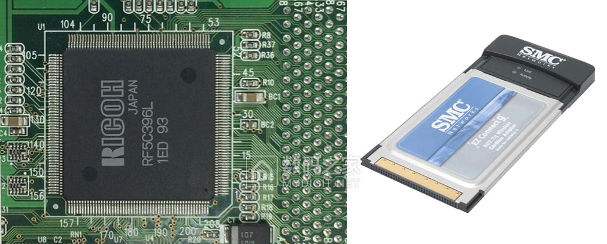

另一个重要接口是PCMCIA扩展，我们采用了RF5C396L作为PCMCIA控制器，由于我们的总线是ISA 只有16位，毫无疑问这个控制器也是16位的。对于PCMCIA卡来讲，16位的扩展卡在种类上收到了极大限制。不过我们的CPU才是瓶颈，对于386SX来讲已经足够。我们能够通过16位的PCMCIA插槽扩展微硬盘，CF卡等存储设备，也可以扩展有线网卡，无线网卡。

以上是便主板上比较重要的一些功能介绍，后面我会跟大家分享外壳的制作，组装以及运行测试。希望大家能关注我，开发的动力源于大家的支持，谢谢大家。
(主体共有16片PCB组成，其中芯片组模块，底板，网卡声卡板 是四层板。 其余均为双面板，下面是原理图和PCB文件，有兴趣的朋友可以一起研究)
观看组装以及运行视频也可以访问我的视频主页 [https://space.bilibili.com/384722209](https://space.bilibili.com/384722209)

## 资料
- [ALD386-图纸1-8.rar](https://9game.oss-us-west-1.aliyuncs.com/book8088stories/files/20230423_ALD386-blueprint1-8.rar)
- [ALD386-图纸9-16.rar](https://9game.oss-us-west-1.aliyuncs.com/book8088stories/files/20230423_ALD386-blueprint9-16.rar)