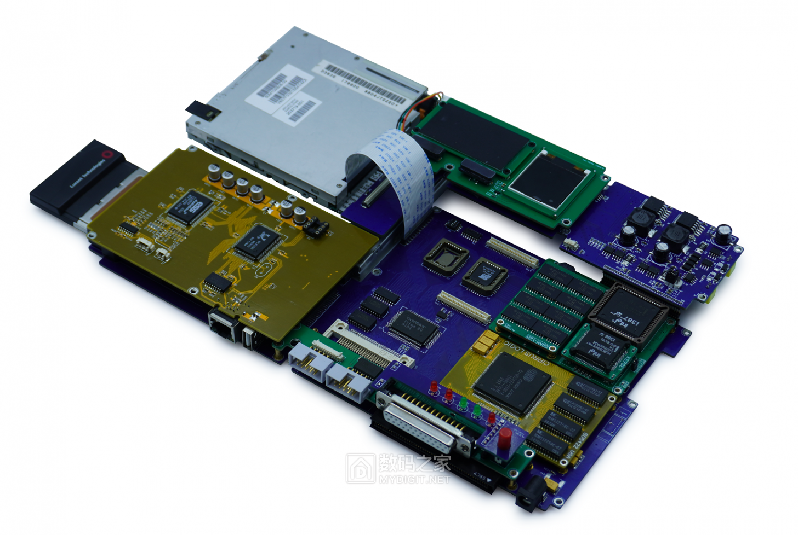
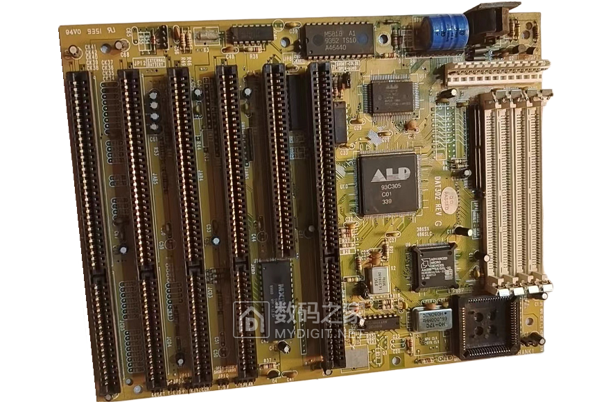
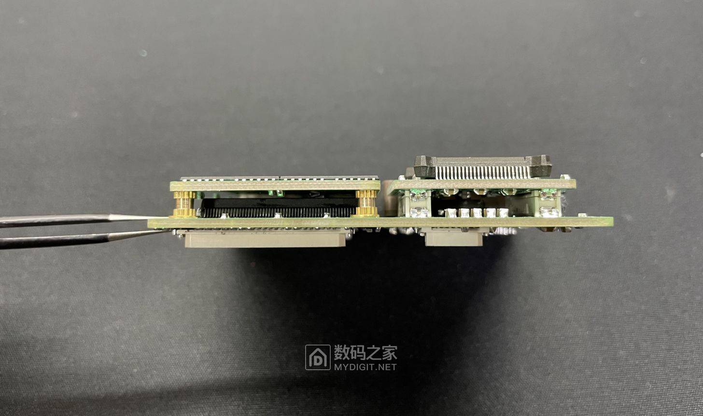
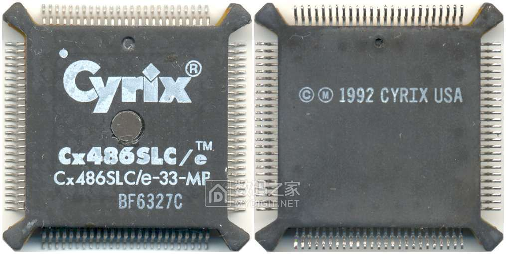
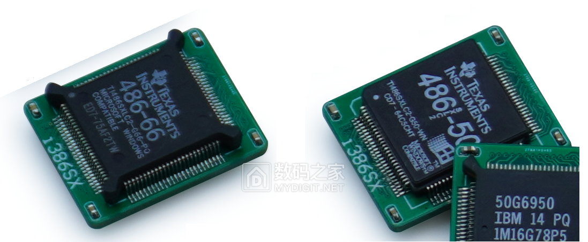
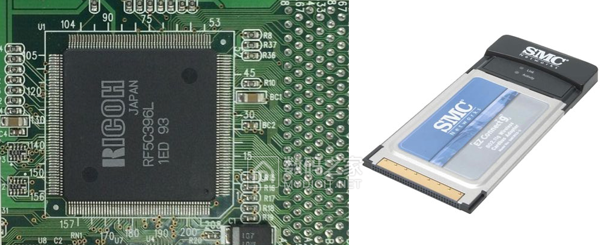

# Building the Dream Laptop - 386SX Running Windows 95

Originally posted on April 23, 2023: [https://www.mydigit.cn/thread-383605-1-1.html](https://www.mydigit.cn/thread-383605-1-1.html)

Hello, fellow forum members!

It has been 7 years since I first posted about replicating an IBM PC-compatible machine, and it has been 12 years since I started studying microcomputer principles. During this period, I have never stopped learning and have met many friends interested in electronics and vintage computers. Whenever I talk about my ideas, I often face a lot of skepticism: why spend so much time researching, what's the use, and whether these outdated technologies are worth it. In fact, everyone has their hobbies, and this is just a very ordinary one that indeed helps greatly with my work. I will continue to study and will keep updating. Thank you for your support!

What are the minimum requirements to run Windows 95? The answer is a 386SX, which is a full 386 core CPU, only its external bus is 16-bit, but this does not affect the 32-bit instructions. Therefore, the 386SX is fully capable.

This is the laptop I designed with a 386SX CPU. It has a modular design allowing the replacement of the CPU, memory, graphics card, sound card, network card, and other main components. Not only that! Its CPU is mounted on a separate module, which includes the CPU, memory, and chipset, meaning replacing this module is like swapping the entire platform. If a 486 core module is made later, there's no need to change the baseboard and other components.

This is the chipset module, essentially a complete motherboard with a 16-bit ISA interface at the bottom. Other modules are expanded through this ISA interface. It includes an ALD93c308 chipset, which might not be familiar to many, but I believe many have seen similar yellow 386 motherboards, (I used the 93c308 version). There's no information on the chipset itself, but the pins of other chips are known, so it's not difficult to deduce the pin definitions of the 93C308 chipset (I'll skip the description of this process due to potential unpredictable implications). Afterwards, we can plan our own circuit board.

(Internet image of a 386SX motherboard)

The bottom of the motherboard module mainly consists of an ISA bus controller (including RTC clock), BIOS, and ISA expansion interface.

After installing other modules, the motherboard module assembly is completed. It supports 386SX, as well as 486SLC and 486DLC, which are essentially enhanced versions of the 386SX. Although the 486SLC/DLC can only be considered as an enhanced 386SX, tests have shown that their performance already surpasses the early low-frequency 386DX versions, representing a significant improvement. Naturally, we need to research the supported CPUs.

First, there's the basic 386SX40, which can stably run at a 40MHZ frequency, with a clock speed of 0.04GHZ. Although it's one of the cheapest members of the 386 family, its 40MHZ frequency can definitely surpass early low-frequency 386DX versions. Moreover, it has a more advanced manufacturing process (referring to the 1000 nanometer process), so compared to early power-hungry versions, its power consumption in the entire system is negligible.

Second is the Cyrix 486SLC, Cyrix's first CPU released in 1992, with 25M and 33M frequencies for SLC-25/33, respectively. Despite having 1KB L1 cache and some 486 instructions, it's not as good as the 386SX40 and also has higher power consumption. However, the later released SLC2, with a 50Mhz frequency, has performance that already surpasses the 386SX40 in this era where frequency determines performance.

Third is the Ti 486SXLC2-50/66, with 8KB of L1 cache and internally running at double the clock speed, reaching frequencies of 50/66MHZ, offering a significant performance improvement over the 386SX40.

Fourth is the IBM 486SLC2, a rare chip because at the time, INTEL did not allow IBM to sell this chip separately but allowed it to be sold mounted on motherboards. Therefore, this CPU is mostly found in IBM's own PS2 models and OEM motherboards, featuring 16KB of cache. There's also a 486SLC3 processor running at triple the clock frequency, reaching up to 100MHZ! After buying many PS2 machines said to contain this chip, though I acquired the chip, due to scarce information and the motherboard using IBM's own MCA bus, development faced significant difficulties, forcing me to reluctantly give up.

Finally, this chipset also supports the 486DLC processor with a 32-bit bus, which can operate in 16-bit bus mode. Due to the chip's size being too large for our module, we did not design related modules, but it's confirmed to be perfectly supported, with performance similar to the 486SLC2.

Previously, we introduced some modules mounted on the main body. There are two important expansion interfaces. One is the indispensable ISA interface for DIY, with this design reserving a full 16-bit ISA interface, compatible with an expansion board to extend three ISA slots for expanding some functions beyond the motherboard.

Another important interface is the PCMCIA expansion. We used RF5C396L as the PCMCIA controller. Since our bus is an ISA with only 16 bits, without a doubt, this controller is also 16-bit. For PCMCIA cards, the types of 16-bit expansion cards are greatly limited. However, our bottleneck is the CPU, which is already sufficient for a 386SX. We can expand storage devices like microdrives and CF cards through the 16-bit PCMCIA slot, as well as wired and wireless network cards.

The above introduces some important functions on the motherboard. Later, I'll share the creation of the casing, assembly, and operational testing. I hope you'll follow me. The motivation for development comes from your support. Thank you.
(The body consists of 16 PCBs, among which the chipset module, baseboard, and network/sound card boards are four-layer boards. The rest are double-sided boards. Below are the schematics and PCB files for those interested in researching together.)
You can also watch the assembly and operation videos on my video homepage [https://space.bilibili.com/384722209](https://space.bilibili.com/384722209)

## Materials
- [ALD386-Blueprints1-8.rar](https://9game.oss-us-west-1.aliyuncs.com/book8088stories/files/20230423_ALD386-blueprint1-8.rar)
- [ALD386-Blueprints9-16.rar](https://9game.oss-us-west-1.aliyuncs.com/book8088stories/files/20230423_ALD386-blueprint9-16.rar)